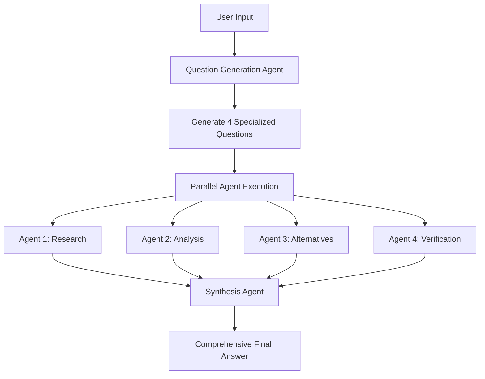

This file is a merged representation of the entire codebase, combined into a single document by Repomix.
The content has been processed where security check has been disabled.

# File Summary

## Purpose
This file contains a packed representation of the entire repository's contents.
It is designed to be easily consumable by AI systems for analysis, code review,
or other automated processes.

## File Format
The content is organized as follows:
1. This summary section
2. Repository information
3. Directory structure
4. Repository files (if enabled)
5. Multiple file entries, each consisting of:
  a. A header with the file path (## File: path/to/file)
  b. The full contents of the file in a code block

## Usage Guidelines
- This file should be treated as read-only. Any changes should be made to the
  original repository files, not this packed version.
- When processing this file, use the file path to distinguish
  between different files in the repository.
- Be aware that this file may contain sensitive information. Handle it with
  the same level of security as you would the original repository.

## Notes
- Some files may have been excluded based on .gitignore rules and Repomix's configuration
- Binary files are not included in this packed representation. Please refer to the Repository Structure section for a complete list of file paths, including binary files
- Files matching patterns in .gitignore are excluded
- Files matching default ignore patterns are excluded
- Security check has been disabled - content may contain sensitive information
- Files are sorted by Git change count (files with more changes are at the bottom)

# Directory Structure
```
tools/
  __init__.py
  base_tool.py
  calculator_tool.py
  read_file_tool.py
  search_tool.py
  task_done_tool.py
  write_file_tool.py
.gitignore
agent.py
config.yaml
LICENSE
main.py
make_it_heavy.py
orchestrator.py
README.md
requirements.txt
```

# Files

## File: tools/__init__.py
````python
import os
import importlib
from typing import Dict, List
from .base_tool import BaseTool

def discover_tools(config: dict = None, silent: bool = False) -> Dict[str, BaseTool]:
    """Automatically discover and load all tools from the tools directory"""
    tools = {}
    
    # Get the tools directory path
    tools_dir = os.path.dirname(__file__)
    
    # Scan for Python files (excluding __init__.py and base_tool.py)
    for filename in os.listdir(tools_dir):
        if filename.endswith('.py') and filename not in ['__init__.py', 'base_tool.py']:
            module_name = filename[:-3]  # Remove .py extension
            
            try:
                # Import the module
                module = importlib.import_module(f'.{module_name}', package='tools')
                
                # Find tool classes that inherit from BaseTool
                for item_name in dir(module):
                    item = getattr(module, item_name)
                    if (isinstance(item, type) and 
                        issubclass(item, BaseTool) and 
                        item != BaseTool):
                        
                        # Instantiate the tool
                        tool_instance = item(config or {})
                        tools[tool_instance.name] = tool_instance
                        if not silent:
                            print(f"Loaded tool: {tool_instance.name}")
                        
            except Exception as e:
                if not silent:
                    print(f"Warning: Could not load tool from {filename}: {e}")
    
    return tools
````

## File: tools/base_tool.py
````python
from abc import ABC, abstractmethod
from typing import Dict, Any, List

class BaseTool(ABC):
    """Base class for all tools"""
    
    @property
    @abstractmethod
    def name(self) -> str:
        """Tool name for OpenRouter function calling"""
        pass
    
    @property
    @abstractmethod
    def description(self) -> str:
        """Tool description for OpenRouter"""
        pass
    
    @property
    @abstractmethod
    def parameters(self) -> Dict[str, Any]:
        """OpenRouter function parameters schema"""
        pass
    
    @abstractmethod
    def execute(self, **kwargs) -> Any:
        """Execute the tool with given parameters"""
        pass
    
    def to_openrouter_schema(self) -> Dict[str, Any]:
        """Convert tool to OpenRouter function schema"""
        return {
            "type": "function",
            "function": {
                "name": self.name,
                "description": self.description,
                "parameters": self.parameters
            }
        }
````

## File: tools/calculator_tool.py
````python
from .base_tool import BaseTool
import math
import ast
import operator

class CalculatorTool(BaseTool):
    def __init__(self, config: dict):
        self.config = config
        # Safe operators for evaluation
        self.safe_operators = {
            ast.Add: operator.add,
            ast.Sub: operator.sub,
            ast.Mult: operator.mul,
            ast.Div: operator.truediv,
            ast.Pow: operator.pow,
            ast.USub: operator.neg,
            ast.UAdd: operator.pos,
            ast.Mod: operator.mod,
        }
        
        # Safe functions
        self.safe_functions = {
            'abs': abs,
            'round': round,
            'max': max,
            'min': min,
            'sum': sum,
            'sqrt': math.sqrt,
            'sin': math.sin,
            'cos': math.cos,
            'tan': math.tan,
            'log': math.log,
            'log10': math.log10,
            'exp': math.exp,
            'pi': math.pi,
            'e': math.e,
        }
    
    @property
    def name(self) -> str:
        return "calculate"
    
    @property
    def description(self) -> str:
        return "Perform mathematical calculations and evaluations"
    
    @property
    def parameters(self) -> dict:
        return {
            "type": "object",
            "properties": {
                "expression": {
                    "type": "string",
                    "description": "Mathematical expression to evaluate (e.g., '2 + 3 * 4', 'sqrt(16)', 'sin(pi/2)')"
                }
            },
            "required": ["expression"]
        }
    
    def _safe_eval(self, node):
        """Safely evaluate an AST node"""
        if isinstance(node, ast.Constant):  # Numbers
            return node.value
        elif isinstance(node, ast.Name):  # Variables/constants
            if node.id in self.safe_functions:
                return self.safe_functions[node.id]
            else:
                raise ValueError(f"Unknown variable: {node.id}")
        elif isinstance(node, ast.BinOp):  # Binary operations
            left = self._safe_eval(node.left)
            right = self._safe_eval(node.right)
            if type(node.op) in self.safe_operators:
                return self.safe_operators[type(node.op)](left, right)
            else:
                raise ValueError(f"Unsupported operation: {type(node.op)}")
        elif isinstance(node, ast.UnaryOp):  # Unary operations
            operand = self._safe_eval(node.operand)
            if type(node.op) in self.safe_operators:
                return self.safe_operators[type(node.op)](operand)
            else:
                raise ValueError(f"Unsupported unary operation: {type(node.op)}")
        elif isinstance(node, ast.Call):  # Function calls
            func = self._safe_eval(node.func)
            args = [self._safe_eval(arg) for arg in node.args]
            return func(*args)
        else:
            raise ValueError(f"Unsupported node type: {type(node)}")
    
    def execute(self, expression: str) -> dict:
        """Execute mathematical calculation"""
        try:
            # Parse the expression
            tree = ast.parse(expression, mode='eval')
            
            # Evaluate safely
            result = self._safe_eval(tree.body)
            
            return {
                "expression": expression,
                "result": result,
                "success": True
            }
        
        except Exception as e:
            return {
                "expression": expression,
                "error": str(e),
                "success": False
            }
````

## File: tools/read_file_tool.py
````python
from .base_tool import BaseTool
import os

class ReadFileTool(BaseTool):
    def __init__(self, config: dict):
        self.config = config
    
    @property
    def name(self) -> str:
        return "read_file"
    
    @property
    def description(self) -> str:
        return "Read the complete contents of a file from the file system. Handles various text encodings and provides detailed error messages if the file cannot be read."
    
    @property
    def parameters(self) -> dict:
        return {
            "type": "object",
            "properties": {
                "path": {
                    "type": "string",
                    "description": "The file path to read"
                },
                "head": {
                    "type": "integer",
                    "description": "If provided, returns only the first N lines of the file"
                },
                "tail": {
                    "type": "integer",
                    "description": "If provided, returns only the last N lines of the file"
                }
            },
            "required": ["path"]
        }
    
    def execute(self, path: str, head: int = None, tail: int = None) -> dict:
        try:
            # Validate parameters
            if head is not None and tail is not None:
                return {"error": "Cannot specify both head and tail parameters"}
            
            # Check if file exists
            if not os.path.exists(path):
                return {"error": f"File not found: {path}"}
            
            # Check if it's actually a file (not a directory)
            if not os.path.isfile(path):
                return {"error": f"Path is not a file: {path}"}
            
            # Read file with appropriate method
            if head is not None:
                # Read first N lines
                with open(path, 'r', encoding='utf-8') as f:
                    lines = []
                    for i in range(head):
                        line = f.readline()
                        if not line:  # EOF reached
                            break
                        lines.append(line)
                    content = ''.join(lines).rstrip('\n')
            elif tail is not None:
                # Read last N lines
                with open(path, 'r', encoding='utf-8') as f:
                    lines = f.readlines()
                    content = ''.join(lines[-tail:]).rstrip('\n') if lines else ""
            else:
                # Read entire file
                with open(path, 'r', encoding='utf-8') as f:
                    content = f.read()
            
            return {
                "path": path,
                "content": content,
                "success": True
            }
        
        except UnicodeDecodeError as e:
            return {"error": f"Failed to decode file as UTF-8: {str(e)}"}
        except PermissionError:
            return {"error": f"Permission denied reading file: {path}"}
        except Exception as e:
            return {"error": f"Failed to read file: {str(e)}"}
````

## File: tools/search_tool.py
````python
from .base_tool import BaseTool
from ddgs import DDGS
from bs4 import BeautifulSoup
import requests
import json

class SearchTool(BaseTool):
    def __init__(self, config: dict):
        self.config = config
    
    @property
    def name(self) -> str:
        return "search_web"
    
    @property
    def description(self) -> str:
        return "Search the web using DuckDuckGo for current information"
    
    @property
    def parameters(self) -> dict:
        return {
            "type": "object",
            "properties": {
                "query": {
                    "type": "string",
                    "description": "Search query to find information on the web"
                },
                "max_results": {
                    "type": "integer",
                    "description": "Maximum number of search results to return",
                    "default": 5
                }
            },
            "required": ["query"]
        }
    
    def execute(self, query: str, max_results: int = 5) -> list:
        """Search the web using DuckDuckGo and fetch page content"""
        try:
            # Use ddgs library
            ddgs = DDGS()
            results = ddgs.text(query, max_results=max_results)
            
            simplified_results = []
            
            for result in results:
                try:
                    # Fetch content with requests
                    response = requests.get(
                        result['href'], 
                        headers={'User-Agent': self.config.get('search', {}).get('user_agent', 'Mozilla/5.0')},
                        timeout=10
                    )
                    response.raise_for_status()
                    
                    # Parse HTML with BeautifulSoup
                    soup = BeautifulSoup(response.text, 'html.parser')
                    
                    # Remove script and style elements
                    for script in soup(["script", "style"]):
                        script.decompose()
                    
                    # Get text content
                    text = soup.get_text()
                    # Clean up whitespace
                    text = ' '.join(text.split())
                    
                    # Limit content length
                    content_snippet = text[:1000] + "..." if len(text) > 1000 else text
                    
                    simplified_results.append({
                        "title": result['title'],
                        "url": result['href'],
                        "snippet": result['body'],
                        "content": content_snippet
                    })
                
                except Exception as e:
                    # If we can't fetch the page, still include the search result
                    simplified_results.append({
                        "title": result['title'],
                        "url": result['href'],
                        "snippet": result['body'],
                        "content": f"Could not fetch content: {str(e)}"
                    })
            
            return simplified_results
        
        except Exception as e:
            return [{"error": f"Search failed: {str(e)}"}]
````

## File: tools/task_done_tool.py
````python
from .base_tool import BaseTool

class TaskDoneTool(BaseTool):
    def __init__(self, config: dict):
        self.config = config
    
    @property
    def name(self) -> str:
        return "mark_task_complete"
    
    @property
    def description(self) -> str:
        return "REQUIRED: Call this tool when the user's original request has been fully satisfied and you have provided a complete answer. This signals task completion and exits the agent loop."
    
    @property
    def parameters(self) -> dict:
        return {
            "type": "object",
            "properties": {
                "task_summary": {
                    "type": "string",
                    "description": "Brief summary of what was accomplished"
                },
                "completion_message": {
                    "type": "string",
                    "description": "Message to show the user indicating the task is complete"
                }
            },
            "required": ["task_summary", "completion_message"]
        }
    
    def execute(self, task_summary: str, completion_message: str) -> dict:
        """Mark a task as complete"""
        return {
            "status": "completed",
            "task_summary": task_summary,
            "completion_message": completion_message,
            "timestamp": self._get_timestamp()
        }
    
    def _get_timestamp(self) -> str:
        """Get current timestamp"""
        from datetime import datetime
        return datetime.now().strftime("%Y-%m-%d %H:%M:%S")
````

## File: tools/write_file_tool.py
````python
from .base_tool import BaseTool
import os
import tempfile

class WriteFileTool(BaseTool):
    def __init__(self, config: dict):
        self.config = config
    
    @property
    def name(self) -> str:
        return "write_file"
    
    @property
    def description(self) -> str:
        return "Create a new file or completely overwrite an existing file with new content. Use with caution as it will overwrite existing files without warning."
    
    @property
    def parameters(self) -> dict:
        return {
            "type": "object",
            "properties": {
                "path": {
                    "type": "string",
                    "description": "The file path to write to"
                },
                "content": {
                    "type": "string",
                    "description": "The content to write to the file"
                }
            },
            "required": ["path", "content"]
        }
    
    def execute(self, path: str, content: str) -> dict:
        try:
            # Get absolute path
            abs_path = os.path.abspath(path)
            
            # Create parent directories if needed
            parent_dir = os.path.dirname(abs_path)
            if parent_dir and not os.path.exists(parent_dir):
                os.makedirs(parent_dir, exist_ok=True)
            
            # Write file atomically using temporary file
            temp_path = abs_path + '.tmp'
            try:
                with open(temp_path, 'w', encoding='utf-8') as f:
                    f.write(content)
                
                # Atomic rename
                os.rename(temp_path, abs_path)
                
                return {
                    "path": abs_path,
                    "bytes_written": len(content.encode('utf-8')),
                    "success": True,
                    "message": f"Successfully wrote to {path}"
                }
            
            except Exception as e:
                # Clean up temp file if it exists
                if os.path.exists(temp_path):
                    try:
                        os.remove(temp_path)
                    except:
                        pass
                raise e
        
        except PermissionError:
            return {"error": f"Permission denied writing to file: {path}"}
        except OSError as e:
            return {"error": f"OS error writing file: {str(e)}"}
        except Exception as e:
            return {"error": f"Failed to write file: {str(e)}"}
````

## File: .gitignore
````
# Byte-compiled / optimized / DLL files
__pycache__/
*.py[cod]
*$py.class

# C extensions
*.so

# Distribution / packaging
.Python
build/
develop-eggs/
dist/
downloads/
eggs/
.eggs/
lib/
lib64/
parts/
sdist/
var/
wheels/
*.egg-info/
.installed.cfg
*.egg
MANIFEST

# PyInstaller
#  Usually these files are written by a python script from a template
#  before PyInstaller builds the exe, so as to inject date/other infos into it.
*.manifest
*.spec

# Installer logs
pip-log.txt
pip-delete-this-directory.txt

# Unit test / coverage reports
htmlcov/
.tox/
.nox/
.coverage
.coverage.*
.cache
nosetests.xml
coverage.xml
*.cover
*.py,cover
.hypothesis/
.pytest_cache/

# Translations
*.mo
*.pot

# Django stuff:
*.log
local_settings.py
db.sqlite3
db.sqlite3-journal

# Flask stuff:
instance/
.webassets-cache

# Scrapy stuff:
.scrapy

# Sphinx documentation
docs/_build/

# PyBuilder
target/

# Jupyter Notebook
.ipynb_checkpoints

# IPython
profile_default/
ipython_config.py

# pyenv
.python-version

# pipenv
#   According to pypa/pipenv#598, it is recommended to include Pipfile.lock in version control.
#   However, in case of collaboration, if having platform-specific dependencies or dependencies
#   having no cross-platform support, pipenv may install dependencies that don't work, or not
#   install all needed dependencies.
#Pipfile.lock

# PEP 582; used by e.g. github.com/David-OConnor/pyflow
__pypackages__/

# Celery stuff
celerybeat-schedule
celerybeat.pid

# SageMath parsed files
*.sage.py

# Environments
.env
.venv
env/
venv/
ENV/
env.bak/
venv.bak/

# Spyder project settings
.spyderproject
.spyproject

# Rope project settings
.ropeproject

# mkdocs documentation
/site

# mypy
.mypy_cache/
.dmypy.json
dmypy.json

# Pyre type checker
.pyre/

# pytype static type analyzer
.pytype/

# Cython debug symbols
cython_debug/

# IDEs and editors
.vscode/
.idea/
*.swp
*.swo
*~

# Vim
*.swp
*.swo
.netrwhist

# Emacs
*~
\#*\#
/.emacs.desktop
/.emacs.desktop.lock
*.elc
auto-save-list
tramp
.\#*

# Sublime Text
*.tmlanguage.cache
*.tmPreferences.cache
*.stTheme.cache
*.sublime-workspace
*.sublime-project

# OS generated files
.DS_Store
.DS_Store?
._*
.Spotlight-V100
.Trashes
ehthumbs.db
Thumbs.db

# API keys and secrets
.env
*.key
*.pem
api_keys.txt
secrets.txt
.secrets/
credentials.json

# Configuration files with sensitive data
config_local.yaml
config_production.yaml
local_config.yaml
*.local.yaml

# Logs
*.log
logs/
log/

# Temporary files
*.tmp
*.temp
temp/
tmp/

# Cache directories
.cache/
cache/
__pycache__/

# Node.js (if used for tooling)
node_modules/
npm-debug.log*
yarn-debug.log*
yarn-error.log*

# Mac specific
.AppleDouble
.LSOverride

# Windows specific
Thumbs.db
ehthumbs.db
Desktop.ini
$RECYCLE.BIN/

# Linux specific
.directory
.Trash-*

# JetBrains IDEs
.idea/
*.iml
*.iws

# VS Code
.vscode/
*.code-workspace

# PyCharm
.idea/

# Project specific
# Add any project-specific files/directories that should be ignored
# For example:
# data/
# output/
# results/
````

## File: agent.py
````python
import json
import yaml
from openai import OpenAI
from tools import discover_tools

class OpenRouterAgent:
    def __init__(self, config_path="config.yaml", silent=False):
        # Load configuration
        with open(config_path, 'r') as f:
            self.config = yaml.safe_load(f)
        
        # Silent mode for orchestrator (suppresses debug output)
        self.silent = silent
        
        # Initialize OpenAI client with OpenRouter
        self.client = OpenAI(
            base_url=self.config['openrouter']['base_url'],
            api_key=self.config['openrouter']['api_key']
        )
        
        # Discover tools dynamically
        self.discovered_tools = discover_tools(self.config, silent=self.silent)
        
        # Build OpenRouter tools array
        self.tools = [tool.to_openrouter_schema() for tool in self.discovered_tools.values()]
        
        # Build tool mapping
        self.tool_mapping = {name: tool.execute for name, tool in self.discovered_tools.items()}
    
    
    def call_llm(self, messages):
        """Make OpenRouter API call with tools"""
        try:
            response = self.client.chat.completions.create(
                model=self.config['openrouter']['model'],
                messages=messages,
                tools=self.tools
            )
            return response
        except Exception as e:
            raise Exception(f"LLM call failed: {str(e)}")
    
    def handle_tool_call(self, tool_call):
        """Handle a tool call and return the result message"""
        try:
            # Extract tool name and arguments
            tool_name = tool_call.function.name
            tool_args = json.loads(tool_call.function.arguments)
            
            # Call appropriate tool from tool_mapping
            if tool_name in self.tool_mapping:
                tool_result = self.tool_mapping[tool_name](**tool_args)
            else:
                tool_result = {"error": f"Unknown tool: {tool_name}"}
            
            # Return tool result message
            return {
                "role": "tool",
                "tool_call_id": tool_call.id,
                "name": tool_name,
                "content": json.dumps(tool_result)
            }
        
        except Exception as e:
            return {
                "role": "tool",
                "tool_call_id": tool_call.id,
                "name": tool_name,
                "content": json.dumps({"error": f"Tool execution failed: {str(e)}"})
            }
    
    def run(self, user_input: str):
        """Run the agent with user input and return FULL conversation content"""
        # Initialize messages with system prompt and user input
        messages = [
            {
                "role": "system",
                "content": self.config['system_prompt']
            },
            {
                "role": "user",
                "content": user_input
            }
        ]
        
        # Track all assistant responses for full content capture
        full_response_content = []
        
        # Implement agentic loop from OpenRouter docs
        max_iterations = self.config.get('agent', {}).get('max_iterations', 10)
        iteration = 0
        
        while iteration < max_iterations:
            iteration += 1
            if not self.silent:
                print(f"🔄 Agent iteration {iteration}/{max_iterations}")
            
            # Call LLM
            response = self.call_llm(messages)
            
            # Add the response to messages
            assistant_message = response.choices[0].message
            messages.append({
                "role": "assistant",
                "content": assistant_message.content,
                "tool_calls": assistant_message.tool_calls
            })
            
            # Capture assistant content for full response
            if assistant_message.content:
                full_response_content.append(assistant_message.content)
            
            # Check if there are tool calls
            if assistant_message.tool_calls:
                if not self.silent:
                    print(f"🔧 Agent making {len(assistant_message.tool_calls)} tool call(s)")
                # Handle each tool call
                task_completed = False
                for tool_call in assistant_message.tool_calls:
                    if not self.silent:
                        print(f"   📞 Calling tool: {tool_call.function.name}")
                    tool_result = self.handle_tool_call(tool_call)
                    messages.append(tool_result)
                    
                    # Check if this was the task completion tool
                    if tool_call.function.name == "mark_task_complete":
                        task_completed = True
                        if not self.silent:
                            print("✅ Task completion tool called - exiting loop")
                        # Return FULL conversation content, not just completion message
                        return "\n\n".join(full_response_content)
                
                # If task was completed, we already returned above
                if task_completed:
                    return "\n\n".join(full_response_content)
            else:
                if not self.silent:
                    print("💭 Agent responded without tool calls - continuing loop")
            
            # Continue the loop regardless of whether there were tool calls or not
        
        # If max iterations reached, return whatever content we gathered
        return "\n\n".join(full_response_content) if full_response_content else "Maximum iterations reached. The agent may be stuck in a loop."
````

## File: config.yaml
````yaml
# OpenRouter API settings
openrouter:
  api_key: "YOUR KEY"
  base_url: "https://openrouter.ai/api/v1"
  
  # IMPORTANT: When selecting a model, ensure it has a high context window (200k+ tokens recommended)
  # The orchestrator can generate large amounts of results from multiple agents that need to be
  # processed together during synthesis. Low context window models may fail or truncate results.
  model: "moonshotai/kimi-k2"

# System prompt for the agent
system_prompt: |
  You are a helpful research assistant. When users ask questions that require 
  current information or web search, use the search tool and all other tools available to find relevant 
  information and provide comprehensive answers based on the results.
  
  IMPORTANT: When you have fully satisfied the user's request and provided a complete answer, 
  you MUST call the mark_task_complete tool with a summary of what was accomplished and 
  a final message for the user. This signals that the task is finished.

# Agent settings
agent:
  max_iterations: 10

# Orchestrator settings
orchestrator:
  parallel_agents: 4  # Number of agents to run in parallel
  task_timeout: 300   # Timeout in seconds per agent
  aggregation_strategy: "consensus"  # How to combine results
  
  # Question generation prompt for orchestrator
  question_generation_prompt: |
    You are an orchestrator that needs to create {num_agents} different questions to thoroughly analyze this topic from multiple angles.
    
    Original user query: {user_input}
    
    Generate exactly {num_agents} different, specific questions that will help gather comprehensive information about this topic.
    Each question should approach the topic from a different angle (research, analysis, verification, alternatives, etc.).
    
    Return your response as a JSON array of strings, like this:
    ["question 1", "question 2", "question 3", "question 4"]
    
    Only return the JSON array, nothing else.

  # Synthesis prompt for combining all agent responses
  synthesis_prompt: |
    You have {num_responses} different AI agents that analyzed the same query from different perspectives. 
    Your job is to synthesize their responses into ONE comprehensive final answer.
    
    Here are all the agent responses:
    
    {agent_responses}
    
    IMPORTANT: Just synthesize these into ONE final comprehensive answer that combines the best information from all agents. 
    Do NOT call mark_task_complete or any other tools. Do NOT mention that you are synthesizing multiple responses. 
    Simply provide the final synthesized answer directly as your response.

# Search tool settings
search:
  max_results: 5
  user_agent: "Mozilla/5.0 (compatible; OpenRouter Agent)"
````

## File: LICENSE
````
MIT License with Attribution Requirement for Large-Scale Commercial Use

Copyright (c) 2025 Pietro Schirano

Permission is hereby granted, free of charge, to any person obtaining a copy
of this software and associated documentation files (the "Software"), to deal
in the Software without restriction, including without limitation the rights
to use, copy, modify, merge, publish, distribute, sublicense, and/or sell
copies of the Software, and to permit persons to whom the Software is
furnished to do so, subject to the following conditions:

The above copyright notice and this permission notice shall be included in all
copies or substantial portions of the Software.

ADDITIONAL COMMERCIAL ATTRIBUTION REQUIREMENT:
If you use this Software, in whole or in part, in any product, service, or 
application that serves more than 100,000 users, you must:

1. Provide clear attribution to Pietro Schirano as the original creator
2. Include a statement that your product uses the "Make It heavy" framework
3. This attribution must be visible in one of the following locations:
   - Product documentation
   - About page/section
   - Credits section
   - Help/support documentation
   - Or equivalent user-accessible location

Example attribution: "Powered by Make It heavy framework by Pietro Schirano"
or "Uses Make It heavy multi-agent system created by Pietro Schirano"

THE SOFTWARE IS PROVIDED "AS IS", WITHOUT WARRANTY OF ANY KIND, EXPRESS OR
IMPLIED, INCLUDING BUT NOT LIMITED TO THE WARRANTIES OF MERCHANTABILITY,
FITNESS FOR A PARTICULAR PURPOSE AND NONINFRINGEMENT. IN NO EVENT SHALL THE
AUTHORS OR COPYRIGHT HOLDERS BE LIABLE FOR ANY CLAIM, DAMAGES OR OTHER
LIABILITY, WHETHER IN AN ACTION OF CONTRACT, TORT OR OTHERWISE, ARISING FROM,
OUT OF OR IN CONNECTION WITH THE SOFTWARE OR THE USE OR OTHER DEALINGS IN THE
SOFTWARE.
````

## File: main.py
````python
from agent import OpenRouterAgent

def main():
    """Main entry point for the OpenRouter agent"""
    print("OpenRouter Agent with DuckDuckGo Search")
    print("Type 'quit', 'exit', or 'bye' to exit")
    print("-" * 50)
    
    try:
        agent = OpenRouterAgent()
        print("Agent initialized successfully!")
        print(f"Using model: {agent.config['openrouter']['model']}")
        print("Note: Make sure to set your OpenRouter API key in config.yaml")
        print("-" * 50)
    except Exception as e:
        print(f"Error initializing agent: {e}")
        print("Make sure you have:")
        print("1. Set your OpenRouter API key in config.yaml")
        print("2. Installed all dependencies with: pip install -r requirements.txt")
        return
    
    while True:
        try:
            user_input = input("\nUser: ").strip()
            
            if user_input.lower() in ['quit', 'exit', 'bye']:
                print("Goodbye!")
                break
            
            if not user_input:
                print("Please enter a question or command.")
                continue
            
            print("Agent: Thinking...")
            response = agent.run(user_input)
            print(f"Agent: {response}")
            
        except KeyboardInterrupt:
            print("\n\nExiting...")
            break
        except Exception as e:
            print(f"Error: {e}")
            print("Please try again or type 'quit' to exit.")

if __name__ == "__main__":
    main()
````

## File: make_it_heavy.py
````python
import time
import threading
import sys
from orchestrator import TaskOrchestrator

class OrchestratorCLI:
    def __init__(self):
        self.orchestrator = TaskOrchestrator()
        self.start_time = None
        self.running = False
        
        # Extract model name for display
        model_full = self.orchestrator.config['openrouter']['model']
        # Extract model name (e.g., "google/gemini-2.5-flash-preview-05-20" -> "GEMINI-2.5-FLASH")
        if '/' in model_full:
            model_name = model_full.split('/')[-1]
        else:
            model_name = model_full
        
        # Clean up model name for display
        model_parts = model_name.split('-')
        # Take first 3 parts for cleaner display (e.g., gemini-2.5-flash)
        clean_name = '-'.join(model_parts[:3]) if len(model_parts) >= 3 else model_name
        self.model_display = clean_name.upper() + " HEAVY"
        
    def clear_screen(self):
        """Properly clear the entire screen"""
        import os
        os.system('cls' if os.name == 'nt' else 'clear')
    
    def format_time(self, seconds):
        """Format seconds into readable time string"""
        if seconds < 60:
            return f"{int(seconds)}S"
        elif seconds < 3600:
            minutes = int(seconds // 60)
            secs = int(seconds % 60)
            return f"{minutes}M{secs}S"
        else:
            hours = int(seconds // 3600)
            minutes = int((seconds % 3600) // 60)
            return f"{hours}H{minutes}M"
    
    def create_progress_bar(self, status):
        """Create progress visualization based on status"""
        # ANSI color codes
        ORANGE = '\033[38;5;208m'  # Orange color
        RED = '\033[91m'           # Red color
        RESET = '\033[0m'          # Reset color
        
        if status == "QUEUED":
            return "○ " + "·" * 70
        elif status == "INITIALIZING...":
            return f"{ORANGE}◐{RESET} " + "·" * 70
        elif status == "PROCESSING...":
            # Animated processing bar in orange
            dots = f"{ORANGE}:" * 10 + f"{RESET}" + "·" * 60
            return f"{ORANGE}●{RESET} " + dots
        elif status == "COMPLETED":
            return f"{ORANGE}●{RESET} " + f"{ORANGE}:" * 70 + f"{RESET}"
        elif status.startswith("FAILED"):
            return f"{RED}✗{RESET} " + f"{RED}×" * 70 + f"{RESET}"
        else:
            return f"{ORANGE}◐{RESET} " + "·" * 70
    
    def update_display(self):
        """Update the console display with current status"""
        if not self.running:
            return
            
        # Calculate elapsed time
        elapsed = time.time() - self.start_time if self.start_time else 0
        time_str = self.format_time(elapsed)
        
        # Get current progress
        progress = self.orchestrator.get_progress_status()
        
        # Clear screen properly
        self.clear_screen()
        
        # Header with dynamic model name
        print(self.model_display)
        if self.running:
            print(f"● RUNNING • {time_str}")
        else:
            print(f"● COMPLETED • {time_str}")
        print()
        
        # Agent status lines
        for i in range(self.orchestrator.num_agents):
            status = progress.get(i, "QUEUED")
            progress_bar = self.create_progress_bar(status)
            print(f"AGENT {i+1:02d}  {progress_bar}")
        
        print()
        sys.stdout.flush()
    
    def progress_monitor(self):
        """Monitor and update progress display in separate thread"""
        while self.running:
            self.update_display()
            time.sleep(1.0)  # Update every 1 second (reduced flicker)
    
    def run_task(self, user_input):
        """Run orchestrator task with live progress display"""
        self.start_time = time.time()
        self.running = True
        
        # Start progress monitoring in background thread
        progress_thread = threading.Thread(target=self.progress_monitor, daemon=True)
        progress_thread.start()
        
        try:
            # Run the orchestrator
            result = self.orchestrator.orchestrate(user_input)
            
            # Stop progress monitoring
            self.running = False
            
            # Final display update
            self.update_display()
            
            # Show results
            print("=" * 80)
            print("FINAL RESULTS")
            print("=" * 80)
            print()
            print(result)
            print()
            print("=" * 80)
            
            return result
            
        except Exception as e:
            self.running = False
            self.update_display()
            print(f"\nError during orchestration: {str(e)}")
            return None
    
    def interactive_mode(self):
        """Run interactive CLI session"""
        print("Multi-Agent Orchestrator")
        print(f"Configured for {self.orchestrator.num_agents} parallel agents")
        print("Type 'quit', 'exit', or 'bye' to exit")
        print("-" * 50)
        
        try:
            orchestrator_config = self.orchestrator.config['openrouter']
            print(f"Using model: {orchestrator_config['model']}")
            print("Orchestrator initialized successfully!")
            print("Note: Make sure to set your OpenRouter API key in config.yaml")
            print("-" * 50)
        except Exception as e:
            print(f"Error initializing orchestrator: {e}")
            print("Make sure you have:")
            print("1. Set your OpenRouter API key in config.yaml")
            print("2. Installed all dependencies with: pip install -r requirements.txt")
            return
        
        while True:
            try:
                user_input = input("\nUser: ").strip()
                
                if user_input.lower() in ['quit', 'exit', 'bye']:
                    print("Goodbye!")
                    break
                
                if not user_input:
                    print("Please enter a question or command.")
                    continue
                
                print("\nOrchestrator: Starting multi-agent analysis...")
                print()
                
                # Run task with live progress
                result = self.run_task(user_input)
                
                if result is None:
                    print("Task failed. Please try again.")
                
            except KeyboardInterrupt:
                print("\n\nExiting...")
                break
            except Exception as e:
                print(f"Error: {e}")
                print("Please try again or type 'quit' to exit.")

def main():
    """Main entry point for the orchestrator CLI"""
    cli = OrchestratorCLI()
    cli.interactive_mode()

if __name__ == "__main__":
    main()
````

## File: orchestrator.py
````python
import json
import yaml
import time
import threading
from concurrent.futures import ThreadPoolExecutor, as_completed
from typing import List, Dict, Any
from agent import OpenRouterAgent

class TaskOrchestrator:
    def __init__(self, config_path="config.yaml", silent=False):
        # Load configuration
        with open(config_path, 'r') as f:
            self.config = yaml.safe_load(f)
        
        self.num_agents = self.config['orchestrator']['parallel_agents']
        self.task_timeout = self.config['orchestrator']['task_timeout']
        self.aggregation_strategy = self.config['orchestrator']['aggregation_strategy']
        self.silent = silent
        
        # Track agent progress
        self.agent_progress = {}
        self.agent_results = {}
        self.progress_lock = threading.Lock()
    
    def decompose_task(self, user_input: str, num_agents: int) -> List[str]:
        """Use AI to dynamically generate different questions based on user input"""
        
        # Create question generation agent
        question_agent = OpenRouterAgent(silent=True)
        
        # Get question generation prompt from config
        prompt_template = self.config['orchestrator']['question_generation_prompt']
        generation_prompt = prompt_template.format(
            user_input=user_input,
            num_agents=num_agents
        )
        
        # Remove task completion tool to avoid issues
        question_agent.tools = [tool for tool in question_agent.tools if tool.get('function', {}).get('name') != 'mark_task_complete']
        question_agent.tool_mapping = {name: func for name, func in question_agent.tool_mapping.items() if name != 'mark_task_complete'}
        
        try:
            # Get AI-generated questions
            response = question_agent.run(generation_prompt)
            
            # Parse JSON response
            questions = json.loads(response.strip())
            
            # Validate we got the right number of questions
            if len(questions) != num_agents:
                raise ValueError(f"Expected {num_agents} questions, got {len(questions)}")
            
            return questions
            
        except (json.JSONDecodeError, ValueError) as e:
            # Fallback: create simple variations if AI fails
            return [
                f"Research comprehensive information about: {user_input}",
                f"Analyze and provide insights about: {user_input}",
                f"Find alternative perspectives on: {user_input}",
                f"Verify and cross-check facts about: {user_input}"
            ][:num_agents]
    
    def update_agent_progress(self, agent_id: int, status: str, result: str = None):
        """Thread-safe progress tracking"""
        with self.progress_lock:
            self.agent_progress[agent_id] = status
            if result is not None:
                self.agent_results[agent_id] = result
    
    def run_agent_parallel(self, agent_id: int, subtask: str) -> Dict[str, Any]:
        """
        Run a single agent with the given subtask.
        Returns result dictionary with agent_id, status, and response.
        """
        try:
            self.update_agent_progress(agent_id, "PROCESSING...")
            
            # Use simple agent like in main.py
            agent = OpenRouterAgent(silent=True)
            
            start_time = time.time()
            response = agent.run(subtask)
            execution_time = time.time() - start_time
            
            self.update_agent_progress(agent_id, "COMPLETED", response)
            
            return {
                "agent_id": agent_id,
                "status": "success", 
                "response": response,
                "execution_time": execution_time
            }
            
        except Exception as e:
            # Simple error handling
            return {
                "agent_id": agent_id,
                "status": "error",
                "response": f"Error: {str(e)}",
                "execution_time": 0
            }
    
    def aggregate_results(self, agent_results: List[Dict[str, Any]]) -> str:
        """
        Combine results from all agents into a comprehensive final answer.
        Uses the configured aggregation strategy.
        """
        successful_results = [r for r in agent_results if r["status"] == "success"]
        
        if not successful_results:
            return "All agents failed to provide results. Please try again."
        
        # Extract responses for aggregation
        responses = [r["response"] for r in successful_results]
        
        if self.aggregation_strategy == "consensus":
            return self._aggregate_consensus(responses, successful_results)
        else:
            # Default to consensus
            return self._aggregate_consensus(responses, successful_results)
    
    def _aggregate_consensus(self, responses: List[str], _results: List[Dict[str, Any]]) -> str:
        """
        Use one final AI call to synthesize all agent responses into a coherent answer.
        """
        if len(responses) == 1:
            return responses[0]
        
        # Create synthesis agent to combine all responses
        synthesis_agent = OpenRouterAgent(silent=True)
        
        # Build agent responses section
        agent_responses_text = ""
        for i, response in enumerate(responses, 1):
            agent_responses_text += f"=== AGENT {i} RESPONSE ===\n{response}\n\n"
        
        # Get synthesis prompt from config and format it
        synthesis_prompt_template = self.config['orchestrator']['synthesis_prompt']
        synthesis_prompt = synthesis_prompt_template.format(
            num_responses=len(responses),
            agent_responses=agent_responses_text
        )
        
        # Completely remove all tools from synthesis agent to force direct response
        synthesis_agent.tools = []
        synthesis_agent.tool_mapping = {}
        
        # Get the synthesized response
        try:
            final_answer = synthesis_agent.run(synthesis_prompt)
            return final_answer
        except Exception as e:
            # Log the error for debugging
            print(f"\n🚨 SYNTHESIS FAILED: {str(e)}")
            print("📋 Falling back to concatenated responses\n")
            # Fallback: if synthesis fails, concatenate responses
            combined = []
            for i, response in enumerate(responses, 1):
                combined.append(f"=== Agent {i} Response ===")
                combined.append(response)
                combined.append("")
            return "\n".join(combined)
    
    def get_progress_status(self) -> Dict[int, str]:
        """Get current progress status for all agents"""
        with self.progress_lock:
            return self.agent_progress.copy()
    
    def orchestrate(self, user_input: str):
        """
        Main orchestration method.
        Takes user input, delegates to parallel agents, and returns aggregated result.
        """
        
        # Reset progress tracking
        self.agent_progress = {}
        self.agent_results = {}
        
        # Decompose task into subtasks
        subtasks = self.decompose_task(user_input, self.num_agents)
        
        # Initialize progress tracking
        for i in range(self.num_agents):
            self.agent_progress[i] = "QUEUED"
        
        # Execute agents in parallel
        agent_results = []
        
        with ThreadPoolExecutor(max_workers=self.num_agents) as executor:
            # Submit all agent tasks
            future_to_agent = {
                executor.submit(self.run_agent_parallel, i, subtasks[i]): i 
                for i in range(self.num_agents)
            }
            
            # Collect results as they complete
            for future in as_completed(future_to_agent, timeout=self.task_timeout):
                try:
                    result = future.result()
                    agent_results.append(result)
                except Exception as e:
                    agent_id = future_to_agent[future]
                    agent_results.append({
                        "agent_id": agent_id,
                        "status": "timeout",
                        "response": f"Agent {agent_id + 1} timed out or failed: {str(e)}",
                        "execution_time": self.task_timeout
                    })
        
        # Sort results by agent_id for consistent output
        agent_results.sort(key=lambda x: x["agent_id"])
        
        # Aggregate results
        final_result = self.aggregate_results(agent_results)
        
        return final_result
````

## File: README.md
````markdown
# 🚀 Make It heavy

A Python framework to emulate **Grok heavy** functionality using a powerful multi-agent system. Built on OpenRouter's API, Make It heavy delivers comprehensive, multi-perspective analysis through intelligent agent orchestration.

## 🌟 Features

- **🧠 Grok heavy Emulation**: Multi-agent system that delivers deep, comprehensive analysis like Grok heavy mode
- **🔀 Parallel Intelligence**: Deploy 4 specialized agents simultaneously for maximum insight coverage
- **🎯 Dynamic Question Generation**: AI creates custom research questions tailored to each query
- **⚡ Real-time Orchestration**: Live visual feedback during multi-agent execution
- **🛠️ Hot-Swappable Tools**: Automatically discovers and loads tools from the `tools/` directory
- **🔄 Intelligent Synthesis**: Combines multiple agent perspectives into unified, comprehensive answers
- **🎮 Single Agent Mode**: Run individual agents for simpler tasks with full tool access

## 🚀 Quick Start

### Prerequisites

- Python 3.8+
- [uv](https://github.com/astral-sh/uv) (recommended Python package manager)
- OpenRouter API key

### Installation

1. **Clone and setup environment:**
```bash
git clone <https://github.com/Doriandarko/make-it-heavy.git>
cd "make it heavy"

# Create virtual environment with uv
uv venv

# Activate virtual environment
source .venv/bin/activate  # On Windows: .venv\Scripts\activate
```

2. **Install dependencies:**
```bash
uv pip install -r requirements.txt
```

3. **Configure API key:**
```bash
# Edit config.yaml and replace YOUR API KEY HERE with your OpenRouter API key
```

## 🎯 Usage

### Single Agent Mode

Run a single intelligent agent with full tool access:

```bash
uv run main.py
```

**What it does:**
- Loads a single agent with all available tools
- Processes your query step-by-step
- Uses tools like web search, calculator, file operations
- Returns comprehensive response when task is complete

**Example:**
```
User: Research the latest developments in AI and summarize them
Agent: [Uses search tool, analyzes results, provides summary]
```

### Grok heavy Mode (Multi-Agent Orchestration)

Emulate Grok heavy's deep analysis with 4 parallel intelligent agents:

```bash
uv run make_it_heavy.py
```

**How Make It heavy works:**
1. **🎯 AI Question Generation**: Creates 4 specialized research questions from your query
2. **🔀 Parallel Intelligence**: Runs 4 agents simultaneously with different analytical perspectives
3. **⚡ Live Progress**: Shows real-time agent status with visual progress bars
4. **🔄 Intelligent Synthesis**: Combines all perspectives into one comprehensive Grok heavy-style answer

**Example Flow:**
```
User Query: "Who is Pietro Schirano?"

AI Generated Questions:
- Agent 1: "Research Pietro Schirano's professional background and career history"
- Agent 2: "Analyze Pietro Schirano's achievements and contributions to technology"  
- Agent 3: "Find alternative perspectives on Pietro Schirano's work and impact"
- Agent 4: "Verify and cross-check information about Pietro Schirano's current role"

Result: Grok heavy-style comprehensive analysis combining all agent perspectives
```

## 🏗️ Architecture

### Orchestration Flow



### Core Components

#### 1. Agent System (`agent.py`)
- **Self-contained**: Complete agent implementation with tool access
- **Agentic Loop**: Continues working until task completion
- **Tool Integration**: Automatic tool discovery and execution
- **Configurable**: Uses `config.yaml` for all settings

#### 2. Orchestrator (`orchestrator.py`)
- **Dynamic Question Generation**: AI creates specialized questions
- **Parallel Execution**: Runs multiple agents simultaneously  
- **Response Synthesis**: AI combines all agent outputs
- **Error Handling**: Graceful fallbacks and error recovery

#### 3. Tool System (`tools/`)
- **Auto-Discovery**: Automatically loads all tools from directory
- **Hot-Swappable**: Add new tools by dropping files in `tools/`
- **Standardized Interface**: All tools inherit from `BaseTool`

### Available Tools

| Tool | Purpose | Parameters |
|------|---------|------------|
| `search_web` | Web search with DuckDuckGo | `query`, `max_results` |
| `calculate` | Safe mathematical calculations | `expression` |
| `read_file` | Read file contents | `path`, `head`, `tail` |
| `write_file` | Create/overwrite files | `path`, `content` |
| `mark_task_complete` | Signal task completion | `task_summary`, `completion_message` |

## ⚙️ Configuration

Edit `config.yaml` to customize behavior:

```yaml
# OpenRouter API settings
openrouter:
  api_key: "YOUR KEY"
  base_url: "https://openrouter.ai/api/v1"
  model: "openai/gpt-4.1-mini"  # Change model here

# Agent settings
agent:
  max_iterations: 10

# Orchestrator settings
orchestrator:
  parallel_agents: 4  # Number of parallel agents
  task_timeout: 300   # Timeout per agent (seconds)
  
  # Dynamic question generation prompt
  question_generation_prompt: |
    You are an orchestrator that needs to create {num_agents} different questions...
    
  # Response synthesis prompt  
  synthesis_prompt: |
    You have {num_responses} different AI agents that analyzed the same query...

# Tool settings
search:
  max_results: 5
  user_agent: "Mozilla/5.0 (compatible; OpenRouter Agent)"
```

## 🔧 Development

### Adding New Tools

1. Create a new file in `tools/` directory
2. Inherit from `BaseTool`
3. Implement required methods:

```python
from .base_tool import BaseTool

class MyCustomTool(BaseTool):
    @property
    def name(self) -> str:
        return "my_tool"
    
    @property
    def description(self) -> str:
        return "Description of what this tool does"
    
    @property
    def parameters(self) -> dict:
        return {
            "type": "object",
            "properties": {
                "param": {"type": "string", "description": "Parameter description"}
            },
            "required": ["param"]
        }
    
    def execute(self, param: str) -> dict:
        # Tool implementation
        return {"result": "success"}
```

4. The tool will be automatically discovered and loaded!

### Customizing Models

Supports any OpenRouter-compatible model:

```yaml
openrouter:
  model: "anthropic/claude-3.5-sonnet"     # For complex reasoning
  model: "openai/gpt-4.1-mini"             # For cost efficiency  
  model: "google/gemini-2.0-flash-001"     # For speed
  model: "meta-llama/llama-3.1-70b"        # For open source
```

### Adjusting Agent Count

Change number of parallel agents:

```yaml
orchestrator:
  parallel_agents: 6  # Run 6 agents instead of 4
```

**Note**: Make sure your OpenRouter plan supports the concurrent usage!

## 🎮 Examples

### Research Query
```bash
User: "Analyze the impact of AI on software development in 2024"

Single Agent: Comprehensive research report
Grok heavy Mode: 4 specialized perspectives combined into deep, multi-faceted analysis
```

### Technical Question  
```bash
User: "How do I optimize a React application for performance?"

Single Agent: Step-by-step optimization guide
Grok heavy Mode: Research + Analysis + Alternatives + Verification = Complete expert guide
```

### Creative Task
```bash
User: "Create a business plan for an AI startup"

Single Agent: Structured business plan
Grok heavy Mode: Market research + Financial analysis + Competitive landscape + Risk assessment
```

## 🛠️ Troubleshooting

### Common Issues

**API Key Error:**
```
Error: Invalid API key
Solution: Update config.yaml with valid OpenRouter API key
```

**Tool Import Error:**
```
Error: Could not load tool from filename.py
Solution: Check tool inherits from BaseTool and implements required methods
```

**Synthesis Failure:**
```
🚨 SYNTHESIS FAILED: [error message]
Solution: Check model compatibility and API limits
```

**Timeout Issues:**
```
Agent timeout errors
Solution: Increase task_timeout in config.yaml
```

### Debug Mode

For detailed debugging, modify orchestrator to show synthesis process:

```python
# In orchestrator.py
synthesis_agent = OpenRouterAgent(silent=False)  # Enable debug output
```

## 📁 Project Structure

```
make it heavy/
├── main.py                 # Single agent CLI
├── make_it_heavy.py         # Multi-agent orchestrator CLI  
├── agent.py                # Core agent implementation
├── orchestrator.py         # Multi-agent orchestration logic
├── config.yaml             # Configuration file
├── requirements.txt        # Python dependencies
├── README.md               # This file
└── tools/                  # Tool system
    ├── __init__.py         # Auto-discovery system
    ├── base_tool.py        # Tool base class
    ├── search_tool.py      # Web search
    ├── calculator_tool.py  # Math calculations  
    ├── read_file_tool.py   # File reading
    ├── write_file_tool.py  # File writing
    └── task_done_tool.py   # Task completion
```

## 🤝 Contributing

1. Fork the repository
2. Create a feature branch
3. Add new tools or improve existing functionality
4. Test with both single and multi-agent modes
5. Submit a pull request

## 📝 License

MIT License with Commercial Attribution Requirement

**For products with 100K+ users**: Please include attribution to Pietro Schirano and mention the "Make It heavy" framework in your documentation or credits.

See [LICENSE](LICENSE) file for full details.

## 🙏 Acknowledgments

- Built with [OpenRouter](https://openrouter.ai/) for LLM API access
- Uses [uv](https://github.com/astral-sh/uv) for Python package management
- Inspired by **Grok heavy** mode and advanced multi-agent AI systems

---

**Ready to make it heavy?** 🚀

```bash
uv run make_it_heavy.py
```

## Star History

[](https://www.star-history.com/#Doriandarko/make-it-heavy&Date)
````

## File: requirements.txt
````
openai
requests
beautifulsoup4
pyyaml
ddgs
````
